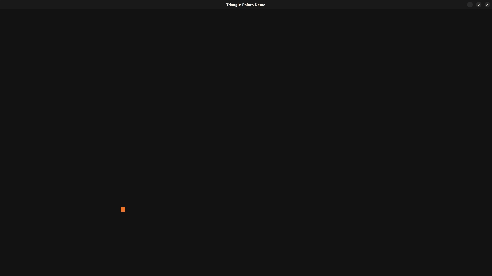
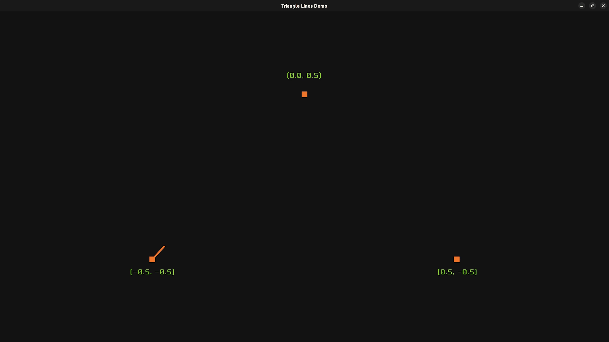
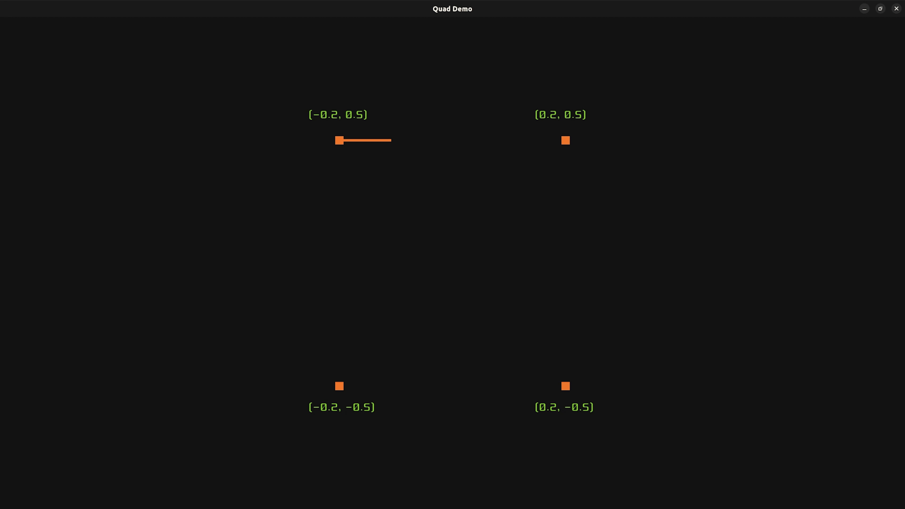
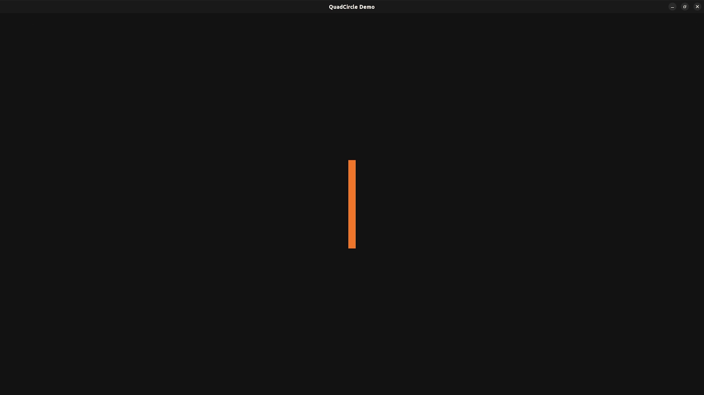

# OpenGL - Animations

The project demonstrates the steps of drawing a circle by using OpenGL primitives. First, a triangle is created, then a quad is formed by triangles. Using quads, a circular shape is created.


## Triangle Points Demo
Displaying the points of a triangle.


## Triangle Lines Demo
OpenGL already has a method to draw triangles. This animation shows process of constructing a triangle, which makes more sense when creating quads.


## Quad Demo
This demo illustrates how to create the primitive elements of a circle shape. It shows one way to create a circle in OpenGL


## Circle Demo
This is the demo for creating circle shapes by using the quads.



# Building the Project

The project build is performed only on Ubuntu 22.04.4 LTS.

> [!WARNING]
> The build process on other platforms has not been tested yet.

Creating and switching to the target build directory.
```bash
$ mkdir build
$ cd build
```
Running the cmake commands.

```bash
$ cmake -DCMAKE_BUILD_TYPE=Debug ..
$ cmake --build .
```

Once the project is built, each individual directory for drawing a demo will contain a Debug folder and an executable file inside it.

```bash
opengl-animations
├── README.md
.
.
.
├── Quad
│   ├── CMakeLists.txt
│   ├── **Debug**
│   └── quad.cpp
├── QuadCircle
│   ├── CMakeLists.txt
│   ├── **Debug**
│   └── quadCircle.cpp
├── README.md
├── resources
│   ├── fonts
│   └── images
├── shared
│   ├── CMakeLists.txt
│   ├── GlfwWindowUtils.cpp
│   └── GlfwWindowUtils.h
├── TriangleLines
│   ├── CMakeLists.txt
│   ├── **Debug**
│   └── triangleLines.cpp
└── TrianglePoints
    ├── CMakeLists.txt
    ├── **Debug**
    └── trianglePoints.cpp
```

### Running one of the Executable
```bash
$ ./QuadCircle/Debug/QuadCircle
```